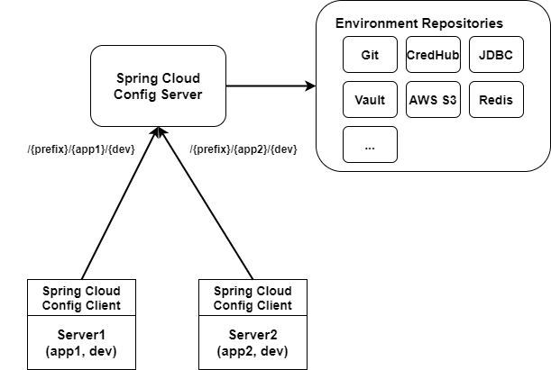
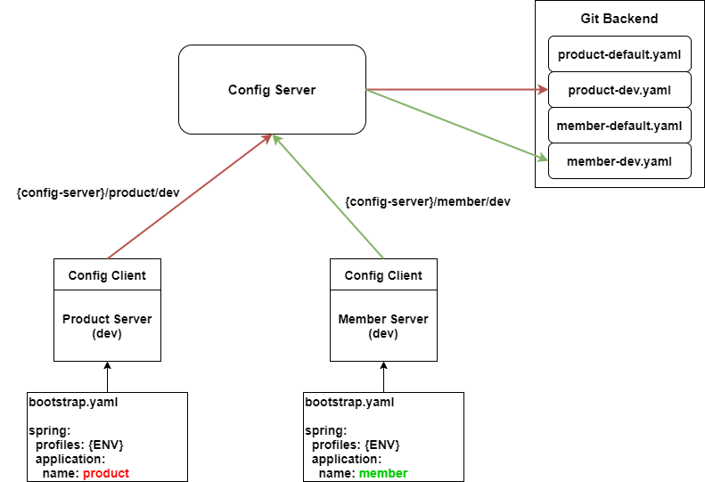
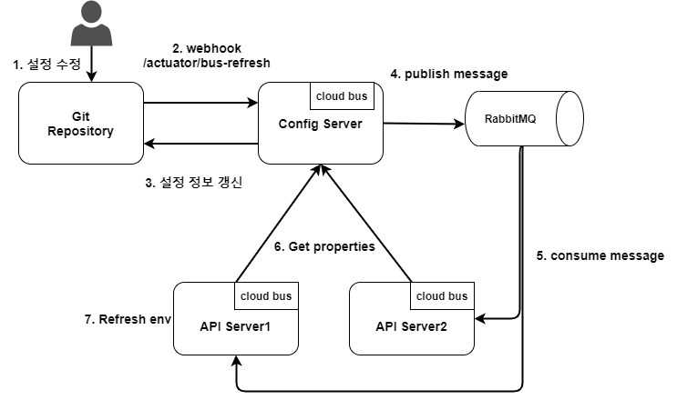

# Spring cloud config server/client  
Spring cloud server 및 client 예제입니다.  

# 목차  

- [Getting Started](#Getting-Started)  
- [Overview](#Overview)  
- [Spring cloud config](#Spring-cloud-config)
- [Spring cloud config server](#Spring-cloud-config-server)
- [Spring cloud config client](#Spring-cloud-config-client)  
- [Spring cloud config with bus](#Spring-cloud-config-with-bus)


---  

# Getting started  

> ## Project 구조  

```cmd
❯ tree ./ -L 3
./
├── compose                                    <-- docker compose 모음
│   └── rabbitmq                         <-- rabbitmq docker compose
│       ├── docker-compose.yaml
│       └── rabbitmq-isolated.conf
├── config-client                               <-- spring cloud config client
├── config-server                               <-- spring cloud config server
└── scripts
    └── start.sh                                <-- spring cloud config server/client 시작 script
```  


> ## local git repository 초기화하기  

```cmd
$ cd ${HOME}
$ mkdir config-repo
$ cd config-repo
$ git init
$ vi demo-default.yaml
$ vi demo-dev.yaml
$ git add .
$ git commit -m "initial"
```  


> ## properties file  

```yaml
# demo-default.yaml
application:
  message: "1. sample message for demo in default stage"

# demo-dev.yaml
application:
  message: "1. sample message for demo in dev stage"
```  


> ## Spring cloud config server 시작하기  

```cmd
// local git을 EnvironmentRepository로 사용하는 Config server를 시작
$ ./scripts/start.sh server
```  


> ## Config 정보 가져오기  

아래와 같은 2가지 Endpoint가 존재한다.  
- /config-server/{application}/{env}
- /config-server/{application}/{env}/{label(commit id, branch name, or tag)}  

```cmd
$ curl -XGET http://localhost:8888/config-server/demo/default,dev | jq .
{
  "name": "demo",
  "profiles": [
    "default,dev"
  ],
  "label": null,
  "version": "36caf2327f83f607fade9d5af47a24133315745d",
  "state": null,
  "propertySources": [
    {
      "name": "file:///Users/evan.kim/config-repo/demo-dev.yaml",
      "source": {
        "application.message": "1. sample message for demo in dev stage"
      }
    },
    {
      "name": "file:///Users/evan.kim/config-repo/demo-default.yaml",
      "source": {
        "application.message": "1. sample message for demo in default stage"
      }
    }
  ]
}

// server log
2020-07-30 23:20:23.807  WARN 26928 --- [nio-8888-exec-1] demo.server.LoggerAspect                 : ## EnvironmentController called: Environment org.springframework.cloud.config.server.environment.EnvironmentController.defaultLabel(String,String)
2020-07-30 23:20:23.809  WARN 26928 --- [nio-8888-exec-1] demo.server.LoggerAspect                 : name : demo / profiles : default,dev / label : null
2020-07-30 23:20:23.814  WARN 26928 --- [nio-8888-exec-1] demo.server.LoggerAspect                 : ## EnvironmentRepository(SearchPathCompositeEnvironmentRepository)::findOne is called
2020-07-30 23:20:23.814  WARN 26928 --- [nio-8888-exec-1] demo.server.LoggerAspect                 : application: demo / profile : default,dev / label : null
org.springframework.cloud.config.server.environment.SearchPathCompositeEnvironmentRepository$$EnhancerBySpringCGLIB$$5b69a901.findOne(<generated>)
org.springframework.cloud.config.server.environment.EnvironmentEncryptorEnvironmentRepository.findOne(EnvironmentEncryptorEnvironmentRepository.java:61)
org.springframework.cloud.config.server.environment.EnvironmentController.getEnvironment(EnvironmentController.java:136)
org.springframework.cloud.config.server.environment.EnvironmentController.defaultLabel(EnvironmentController.java:108)
org.springframework.cloud.config.server.environment.EnvironmentController$$FastClassBySpringCGLIB$$1ca0c4b5.invoke(<generated>)
org.springframework.cloud.config.server.environment.EnvironmentController$$EnhancerBySpringCGLIB$$6d096709.defaultLabel(<generated>)
org.springframework.cloud.config.server.environment.EnvironmentController$$EnhancerBySpringCGLIB$$c7e5ca57.defaultLabel(<generated>)
```  

- config-repo의 설정파일을 변경한 후 요청하면 변경 된 정보를 확인할 수 있다.
- 매 요청마다 EnvironmentRepository에서 findOne() 메소드를 호출하여 설정 정보를 조회한다.  
(git repository를 이용하는 경우 git fetch를 이용)  


<br />  


> ## Spring cloud config server 시작하기  

```cmd
$ ./scripts/start.sh client
```  


> ## Config client의 property 확인하기  

```cmd
$ curl -XGET http://localhost:8080/message                                                                                                                                                                                                                                                                                                                                                     master-!
1. sample message for demo in default stage
```  


- config-repo 에서 설정 파일 값을 변경  

> ## Config client의 Refresh  

```cmd
// get property (refresh 전)
$ curl -XGET http://localhost:8080/message
1. sample message for demo in default stage

// actuator를 이용해서 refresh
$ curl -XPOST http://localhost:8080/actuator/refresh
["config.client.version","application.message"]

// get property (refresh 후)  
$ curl -XGET http://localhost:8080/message
2. sample message for demo in default stage

// custom endpoint를 이용해서 refresh   
$ curl -XPOST http://localhost:8080/refresh
["config.client.version","application.message"]
3. sample message for demo in default stage
```  


> ## event bus를 이용하여 refresh 메시지 전달  

```cmd  
// rabbitmq 실행하기  
$ cd compose/rabbitmq
$ docker-compose up -d  

// config server 실행하기  
$ ./scripts/start.sh server default,rabbitmq

// config client 실행하기  
$ ./scripts/start.sh client default,rabbitmq

// get property  
$ curl -XGET http://localhost:8080/message
3. sample message for demo in default stage

// config 변경 후 config server로 이벤트 전송  
$ curl -XPOST http://localhost:8888/actuator/bus-refresh

// get property  
$ curl -XGET http://localhost:8080/message
4. sample message for demo in default stage
```  


---  

# Overview  
설정 정보를 변경하면 아래와 같은 문제가 발생한다.  

- 애플리케이션을 재시작 해야한다.  
- 어떤 설정 정보가 수정되었는지 확인할 방법이 없고, 수정 내용을 이전 상태로 복구 할 방법이 없다(추적성이 없다).  
- 설정이 여기저기 분산되어 있어서 어디에서 어떤 설정 정보를 변경해야 하는지 파악하기 어렵다.  
- 손쉬운 압호화/복호화 방법이 없다.  

이러한 문제들을 Spring cloud config를 통해서 해결할 수 있다.  

<br />

---  

# Spring cloud config  

> ## Spring cloud config 구성  

  


> ## Spring cloud config server/client 동작방식   

  

<br />

---  

# Spring cloud config server  

- 스프링 클라우드 설정 서버가 제공하는 REST API를 통해서 설정 정보를 읽을 수 있다.  
- config client <-> config server와 config-server와 environment repository 사이에 보안 기능을 추가할 수 있다.  
- `refresh`라는 새로운 `scope`를 통해 재시작 없이 설정 정보 갱신이 가능하다.  
- 기본적으로 {application} / {profiles} / {label} 라는 3가지 키 값을 가지고 설정 정보를 제공한다.  

> application.yaml  

```yaml
server:
  port: 8888

logging:
  level:
    root: warn

spring:
  application:
    name: "config-server"
  cloud:
    config:
      server:
        prefix: /config-server
        git:
          # default 0, 매 요청마다 fetch
          # 단위는 Second 이며 (refresh > 0 && (now() - lastRefresh) < (refreshRate * 1000) 면 fetch 하지 않음
          refreshRate: 5
          # uri: https://github.com/evagova/config-repo
          uri: file://${user.home}/config-repo

---
spring:
  profiles: jdbc
  datasource:
    url: jdbc:h2:mem:testdb?DB_CLOSE_ON_EXIT=FALSE
    username: root
    password: root
    driver-class-name: org.h2.Driver
  cloud:
    config:
      server:
        jdbc:
          sql: SELECT KEY, VALUE from PROPERTIES where APPLICATION=? and PROFILE=? and LABEL=?
          order: 1

---
spring:
  profiles: rabbitmq
  cloud:
    bus:
      env:
        enabled: true
      refresh:
        enabled: true
  rabbitmq:
    host: 127.0.0.1
    port: 5672
    username: user
    password: secret
management:
  endpoints:
    web:
      base-path: /actuator
      exposure:
        include: ['bus-refresh']
```  


> @EnableConfigServer로 서버 구성  

- `@EnableConfigServer` 설정 만으로 쉽게 Config server를 구축할 수 있다.  
- `org.springframework.cloud.config.server.config.ConfigServerAutoConfiguration`를 통해 Auto configure를 확인할 수 있다.

```java
import org.springframework.boot.SpringApplication;
import org.springframework.boot.autoconfigure.SpringBootApplication;
import org.springframework.cloud.bus.BusAutoConfiguration;
import org.springframework.cloud.config.server.EnableConfigServer;

@SpringBootApplication(
        exclude = {
                BusAutoConfiguration.class
        }
)
@EnableConfigServer
public class ConfigServerApplication {
    public static void main(String[] args) {
        SpringApplication.run(ConfigServerApplication.class, args);
    }
}
```  


> org.springframework.cloud.config.server.environment.EnvironmentController  

- 기본적으로 아래와 같은 2가지의 Path를 통해 Environment(설정 정보)를 조회할 수 있다.
    - /{spring.cloud.config.server.prefix}/{name}/{profiles}
    - /{spring.cloud.config.server.prefix}/{name}/{profiles}/{label}
- 더 많은 Endpoint는 `EnvironmentController` 클래스를 살펴보자.

```java
package org.springframework.cloud.config.server.environment;

...

@RestController
@RequestMapping(method = RequestMethod.GET,
		path = "${spring.cloud.config.server.prefix:}")
public class EnvironmentController {
	private EnvironmentRepository repository;
    ...
	@RequestMapping(path = "/{name}/{profiles:.*[^-].*}",
			produces = MediaType.APPLICATION_JSON_VALUE)
	public Environment defaultLabel(@PathVariable String name,
			@PathVariable String profiles) {
		return getEnvironment(name, profiles, null, false);
	}

	@RequestMapping(path = "/{name}/{profiles:.*[^-].*}",
			produces = EnvironmentMediaType.V2_JSON)
	public Environment defaultLabelIncludeOrigin(@PathVariable String name,
			@PathVariable String profiles) {
		return getEnvironment(name, profiles, null, true);
	}

	@RequestMapping(path = "/{name}/{profiles}/{label:.*}",
			produces = MediaType.APPLICATION_JSON_VALUE)
	public Environment labelled(@PathVariable String name, @PathVariable String profiles,
			@PathVariable String label) {
		return getEnvironment(name, profiles, label, false);
	}

	@RequestMapping(path = "/{name}/{profiles}/{label:.*}",
			produces = EnvironmentMediaType.V2_JSON)
	public Environment labelledIncludeOrigin(@PathVariable String name,
			@PathVariable String profiles, @PathVariable String label) {
		return getEnvironment(name, profiles, label, true);
	}        

    ...
}   
```


> org.springframework.cloud.config.server.environment.EnvironmentController    

- 아래와 같이 application, profile, label을 파라미터로 하는 find() 메소드를 가진 인터페이스가 존재한다.
- `org.springframework.cloud.config.server.environment` 패키지를 살펴보면 다양한 구현체들이 존재한다.

```java
package org.springframework.cloud.config.server.environment;

...

public interface EnvironmentRepository {

	Environment findOne(String application, String profile, String label);

	default Environment findOne(String application, String profile, String label,
			boolean includeOrigin) {
		return findOne(application, profile, label);
	}
}
```  


---  

# Spring cloud config client

- 스프링 클라우드 생태계에서 정상적으로 동작하려면 적절한 이름이 필요하다.  
  - `spring.application.name`을 통해 설정이 가능하며 유일하고 실용적이고 기억하기 쉬운 이름으로 설정하자.
- 스프링 클라우드 기반 서비스는 `bootstrap.properties(yaml)` 파일을 이용한다.  
- Config Client는 bootstrap.yaml 파일을 application.yaml 보다 먼저 로딩한 후 application 이름을 찾는다.   

> bootstrap.yaml  

```yaml
spring:
  profiles:
    active: {ENV}
  application:
    name: demo
  cloud:
    config:
      uri: http://localhost:8888/config-server

management:
  endpoints:
    web:
      exposure:
        include: "refresh"
```  


> @RefreshScope  

- 스프링 클라우드는 `@RefreshScope` 어노테이션을 이용해서 변경 된 설정을 적용할 수 있다.
(https://cloud.spring.io/spring-cloud-static/spring-cloud.html#_refresh_scope)  
- actuator의 `/actuator/refresh` Endpoint를 호출하여 갱신할 수 있다.
- actuator를 사용하지 않고 코드로 직접 Refresh 이벤트를 생성할 수 있다.


> @RefreshScope 예제

```java
import org.springframework.cloud.context.config.annotation.RefreshScope;
...

@Slf4j
@RestController
@RefreshScope // 새로고침 가능
public class RefreshRestController {

    private final String message;

    // Environment 추상화 덕분에 PropertySource에서 가져오는 방식 그대로 읽어올 수 있음
    @Autowired
    public RefreshRestController(@Value("${application.message}") String message) {
        logger.warn("## RefreshController() is called. message : {}", message);
        this.message = message;
    }

    @GetMapping("/message")
    public String getMessage() {
        return message;
    }
}
```  


> @EventListener  

- `@EventListener`를 통해 refresh 이벤트 리스너를 등록할 수 있다.

```java
@Component
public class CustomRefreshListener {

    @EventListener
    public void refresh(RefreshScopeRefreshedEvent e) {
        logger.warn("refresh event occur. name : {} / source : {}", e.getName(), e.getSource());
    }
}
```  


> Custom refresh event publisher

```java

import org.springframework.cloud.context.refresh.ContextRefresher;
import org.springframework.cloud.endpoint.RefreshEndpoint;

...

/**
 * See {@link RefreshEndpoint}
 */
@Slf4j
@AllArgsConstructor
@RestController
public class RefreshController {

    private final ContextRefresher contextRefresher;

    @PostMapping("/refresh")
    public Set<String> refresh() {
        logger.warn("## custom /refresh is called");
        return contextRefresher.refresh();
    }
}
```  


---  

# Spring cloud config with bus  

- Spring cloud bus를 이용해서 설정 변경 내용을 여러 설정 클라이언트에 적용할 수 있다.
- Spring cloud stream은 rabbitmq, kafka, reactor project 등의 다양한 메시징 기술을 지원한다.  

  

---  

# References  

- https://cloud.spring.io/spring-cloud-config/reference/html/  
- https://medium.com/@circlee7/spring-cloud-config-%EC%A0%95%EB%A6%AC-1-%EB%B2%88%EC%99%B8-da81585400fa
