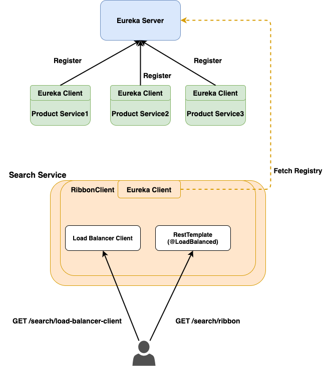

# Loadbalancer  

Spring cloud의 client side loadbalancer를 위한 예제

- [Ribbon](#Ribbon)
  - [인터페이스 및 클래스](#인터페이스-및-클래스)
  - [Spring Cloud Ribbon](#Spring-Cloud-Ribbon)
  - [Ribbon with eureka demo](#Ribbon-with-eureka-demo)

---  

# Ribbon  

- 리본은 Client Side Loadbalancer  
- Spring Cloud를 이용하면 설정만으로 이용할 수 있지만, 로드밸런서를 이해하기 위해 순수 Ribbon에 대해 분석

## 인터페이스 및 클래스

> #### com.netflix.loadbalancer.Server  

- host:ip 식별자를 가지는 서버

```java
public class Server {
    public static interface MetaInfo {
        public String getAppName();
        
        public String getServerGroup();

        public String getServiceIdForDiscovery();

        public String getInstanceId();
    }

    public static final String UNKNOWN_ZONE = "UNKNOWN";
    private String host;
    private int port = 80;
    private String scheme;
    private volatile String id;
    private volatile boolean isAliveFlag;
    private String zone = UNKNOWN_ZONE;
    private volatile boolean readyToServe = true;
    ...
}
```  

<br />

> #### com.netflix.loadbalancer.IPing

- 해당 Server의 Alive를 체크
- 구현체
  - `com.netflix.loadbalancer.PingUrl` : 해당 URL 요청 후 200 + body(optional) 체크
  - `com.netflix.loadbalancer.AbstractLoadBalancerPing`
    - `com.netflix.loadbalancer.DummyPing` : 항상 true 반환
    - `com.netflix.niws.loadbalancer.NIWSDiscoveryPing` : Discovery client에서 유지하는 Status로 결정
  - `com.netflix.loadbalancer.NoOpPing` : 항상 true 반환
  - `com.netflix.loadbalancer.PingConstant` : 지정 된 true/false 반환

```java
public interface IPing {
    public boolean isAlive(Server server);
}
```

<br />

> #### com.netflix.loadbalancer.IRule  

- 주어진 서버 목록 중 어떤 서버를 선택할 지 결정  
- 구현체
  - `com.netflix.loadbalancer.AbstractLoadBalancerRule`
    - `com.netflix.loadbalancer.ClientConfigEnabledRoundRobinRule` : 내부 코드보면 RoundRobinRule 사용?
    - `com.netflix.loadbalancer.RoundRobinRule` : 순차적으로 서버 선택
    - `com.netflix.loadbalancer.RandomRule` : alive 서버 중 랜덤으로 선택==upServers.get(ThreadLocalRandom.current().nextInt(allServerCount))
    - `com.netflix.loadbalancer.RetryRule` : subRule에 대하여 실패 시 재선택  
    
```java
public interface IRule{
    public Server choose(Object key);
    
    public void setLoadBalancer(ILoadBalancer lb);
    
    public ILoadBalancer getLoadBalancer();    
}
```  

<br />  

> #### com.netflix.loadbalancer.ServerList

- 서버 목록을 가져오기 위한 인터페이스. 로드밸런서는 최초 서버 목록 조회 후 매 30초마다 `getUpdatedListOfServers`를 호출하여 Ping 실행
- 구현체
  - `com.netflix.loadbalancer.AbstractServerList`
    - `com.netflix.loadbalancer.ConfigurationBasedServerList` : config 기반의 정적 서버 리스트
    - `com.netflix.niws.loadbalancer.DiscoveryEnabledNIWSServerList` : 내부 `EurekaClient`로 부터 서버 목록 제공

```java
public interface ServerList<T extends Server> {

    public List<T> getInitialListOfServers();
    
    /**
     * Return updated list of servers. This is called say every 30 secs
     * (configurable) by the Loadbalancer's Ping cycle
     */
    public List<T> getUpdatedListOfServers();   

}
```

<br />

> #### com.netflix.loadbalancer.ServerListFilter  

- 대상 서버 중 필터링를 적용
- 구현체
  - `com.netflix.loadbalancer.AbstractServerListFilter`
    - `com.netflix.loadbalancer.ZoneAffinityServerListFilter` : zone affinity,exclusivity 설정에 따라 필터링

```java
/**
 * This interface allows for filtering the configured or dynamically obtained
 * List of candidate servers with desirable characteristics.
 */
public interface ServerListFilter<T extends Server> {

    public List<T> getFilteredListOfServers(List<T> servers);

}
```  

<br />

> #### com.netflix.loadbalancer.ILoadBalancer

- 로드밸런서 인터페이스로 주어진 `key`에 대하여 서버를 선택
- 구현체
  - `com.netflix.loadbalancer.AbstractLoadBalancer`
    - `com.netflix.loadbalancer.BaseLoadBalancer`
      - `com.netflix.loadbalancer.DynamicServerListLoadBalancer`
        - `com.netflix.loadbalancer.ZoneAwareLoadBalancer`
    - `com.netflix.loadbalancer.NoOpLoadBalancer`

```java
public interface ILoadBalancer {
	/**
	 * Initial list of servers.
	 * This API also serves to add additional ones at a later time
	 * The same logical server (host:port) could essentially be added multiple times
	 * (helpful in cases where you want to give more "weightage" perhaps ..)
	 * 
	 * @param newServers new servers to add
	 */
	public void addServers(List<Server> newServers);
	
	/**
	 * Choose a server from load balancer.
	 * 
	 * @param key An object that the load balancer may use to determine which server to return. null if 
	 *         the load balancer does not use this parameter.
	 * @return server chosen
	 */
	public Server chooseServer(Object key);
	
	/**
	 * To be called by the clients of the load balancer to notify that a Server is down
	 * else, the LB will think its still Alive until the next Ping cycle - potentially
	 * (assuming that the LB Impl does a ping)
	 * 
	 * @param server Server to mark as down
	 */
	public void markServerDown(Server server);
	
	/**
	 * @deprecated 2016-01-20 This method is deprecated in favor of the
	 * cleaner {@link #getReachableServers} (equivalent to availableOnly=true)
	 * and {@link #getAllServers} API (equivalent to availableOnly=false).
	 *
	 * Get the current list of servers.
	 *
	 * @param availableOnly if true, only live and available servers should be returned
	 */
	@Deprecated
	public List<Server> getServerList(boolean availableOnly);

	/**
	 * @return Only the servers that are up and reachable.
     */
    public List<Server> getReachableServers();

    /**
     * @return All known servers, both reachable and unreachable.
     */
	public List<Server> getAllServers();
}
```  

<br />

> #### Ribbon loadbalancer 생성 예제  

```java
public class LoadbalancerTest {

    @Test
    public void buildLoadBalancer() throws Throwable {
        final Server server1 = new Server("localhost", 3000);
        final Server server2 = new Server("localhost", 3100);
        final Predicate<Server> predicate = s -> {
            if (s.equals(server1)) {
                return true;
            }
            return new Random().nextInt(2) == 0;
        };
        final ServerListUpdater updater = new PollingServerListUpdater(TimeUnit.SECONDS.toMillis(5L),
                                                                       TimeUnit.SECONDS.toMillis(5L));

        final LoadBalancerBuilder<Server> builder = LoadBalancerBuilder.newBuilder();
        final ZoneAwareLoadBalancer<Server> lb = builder.withPing(new Ping(predicate))
                                                        .withRule(new Rule())
                                                        .withDynamicServerList(
                                                                new StaticServerList(Arrays.asList(server1, server2)))
                                                        .withServerListFilter(new LoggingServerListFilter())
                                                        .withServerListUpdater(updater)
                                                        .buildDynamicServerListLoadBalancer();

        TimeUnit.SECONDS.sleep(30L);

        IntStream.rangeClosed(1, 10).forEach(i -> {
            System.out.println("Try to choose server.");
            final Server server = lb.chooseServer("key" + i);
            System.out.println(">> " + server);

            try {
                TimeUnit.SECONDS.sleep(1L);
            } catch (InterruptedException e) {
                // ignore
            }
        });
    }
}
```

---

## Spring Cloud Ribbon  

Spring Cloud에서는 `org.springframework.cloud:spring-cloud-starter-netflix-ribbon` 만으로 쉽게 Ribbon Client를 생성 할 수 있다.  

<br />

위에서 살펴본 주요 인터페이스의 구현체는 아래와 같이 생성된다.  

| **Bean Type**            | **Bean Name**           | **Class Name**                 | **Eureka**                     |
|--------------------------|-------------------------|--------------------------------|--------------------------------|
| IClientConfig            | ribbonClientConfig      | DefaultClientConfigImpl        |                                |
| IRule                    | ribbonRule              | ZoneAvoidanceRule              |                                |
| IPing                    | ribbonPing              | DummyPing                      | NIWSDiscoveryPing              |
| ServerList<Server>       | ribbonServerList        | ConfigurationBasedServerList   | DiscoveryEnabledNIWSServerList |
| ServerListFilter<Server> | ribbonServerListFilter  | ZonePreferenceServerListFilter |                                |
| ILoadBalancer            | ribbonLoadBalancer      | ZoneAwareLoadBalancer          |                                |
| ServerListUpdater        | ribbonServerListUpdater | PollingServerListUpdater       |                                |

<br />  

또한, 아래와 같이 Java config or properties(or yaml) 파일을 통해 Bean을 커스텀 할 수 있다.(자세한 내용은 [Spring Cloud Docs](https://docs.spring.io/spring-cloud-netflix/docs/2.2.5.RELEASE/reference/html/#spring-cloud-ribbon) 참조)  

> #### Java config

```java
@Configuration
@RibbonClient(name = "custom", configuration = CustomConfiguration.class)
public class TestConfiguration {
}

@Configuration(proxyBeanMethods = false)
protected static class FooConfiguration {

    @Bean
    public ZonePreferenceServerListFilter serverListFilter() {
        ZonePreferenceServerListFilter filter = new ZonePreferenceServerListFilter();
        filter.setZone("myTestZone");
        return filter;
    }

    @Bean
    public IPing ribbonPing() {
        return new PingUrl();
    }

}
```  

> application.yaml  

```yaml
service-id:
  ribbon:
    NFLoadBalancerClassName: ILoadBalancer
    NFLoadBalancerRuleClassName: IRule
    NFLoadBalancerPingClassName: IPing
    NIWSServerListClassName: ServerList
    NIWSServerListFilterClassName: ServerListFilter
```  

---  

## Ribbon with eureka demo

> ### Demo 서버 구성  

아래와 같은 서버를 구성  
- Eureka Server(8761)
- Product Service(3100,3200,3300) : `GET /api/v1/products` 호출 시 자신의 서버 정보와 랜덤 Product 응답
- Search Service(4100) : Ribbon client를 이용하여 Product service로 부터 상품 정보를 가져오는 서비스
  - `GET /search/load-balancer-client` 요청 시 `LoadBalancerClient`를 이용하여 서버 선택
  - `GET /search/ribbon` 요청 시 `@LoadBalanced`의 `RestTemplate`을 이용하여 Product 서버 호출

  

> ### Demo 서버 실행  

```bash
// gradle + docker build
$ ./tools/script/compose.sh build

// run compose
$ ./tools/script/compose.sh up
```  

> ### Search service 호출  

- `tools/request/request.http` 파일을 이용하여 실행
- 아래와 같은 CURL 사용  
```bash
$ curl -XGET http://localhost:4100/search/load-balancer-client

$ curl -XGET http://localhost:4100/search/ribbon
```  

> ### Demo Project 구성

#### 1. Eureka Server  

> bootstrap.yaml  

```yaml
spring:
  application:
    name: eureka-server
```  

> application.yaml  

```yaml
server:
  port: 8761

spring:
  cloud:
    loadbalancer:
      ribbon:
        enabled: false

eureka:
  dashboard:
    path: /eureka-ui
  instance:
    hostname: localhost
    statusPageUrlPath: /actuator/info
    healthCheckUrlPath: /actuator/health
  server:
    enableSelfPreservation: false
    responseCacheUpdateIntervalMs: 30000
  client:
    registerWithEureka: false
    fetchRegistry: false

info:
  app:
    name: Eureka server application
    version: 1.0.0
    discription: This is a demo project for loadbalancer
```  

> main

```java
@Slf4j
@SpringBootApplication
@EnableEurekaServer
public class EurekaServerApplication {
    public static void main(String[] args) {
        new SpringApplicationBuilder(EurekaServerApplication.class).web(WebApplicationType.SERVLET).run(args);
    }
}
```

#### 2. Product Service  

> bootstrap.yaml  

```yaml
spring:
  application:
    name: product-service
eureka:
  instance:
    instance-id: ${spring.application.name}:${spring.application.instance_id:${random.value}}
```

> application.yaml  

```yaml
server:
  port: 3100

spring:
  cloud:
    loadbalancer:
      ribbon:
        enabled: false

eureka:
  instance:
    statusPageUrlPath: /actuator/info
    healthCheckUrlPath: /actuator/health
  client:
    serviceUrl:
      defaultZone: http://localhost:8761/eureka/
    fetch-registry: true

info:
  app:
    name: Product Example Application
    version: 1.0.0
    discription: This is a demo project for loadbalancer
```

> controller  
(5개의 Product + 자신의 metadata 반환)

```java
@GetMapping("/api/v1/products")
public ProductsResource getProducts() {
    final Random rand = new Random();
    final List<Product> products = IntStream.rangeClosed(1, 5)
                                            .boxed()
                                            .map(i -> Product.builder()
                                                             .id(Long.valueOf(i))
                                                             .name("product-" + i)
                                                             .price(rand.nextInt(10000))
                                                             .stockQuantity(rand.nextInt(10))
                                                             .build()).collect(Collectors.toList());
    return ProductsResource.builder().metadata(metadata).products(products).build();
}
```  

#### 3. Search Service

> application.yaml

```yaml
server:
  port: 4100

eureka:
  client:
    serviceUrl:
      defaultZone: http://localhost:8761/eureka/
    # 자신을 eureka에 등록X
    registerWithEureka: false
```  

> Ribbon Config

```java
@Slf4j
@RibbonClients({
        @RibbonClient(name = "product-service", configuration = { ProductLoadbalancerConfig.class })
})
public class RibbonConfiguration {
}

@Slf4j
@Configuration(proxyBeanMethods = false)
public class ProductLoadbalancerConfig {

    @Bean
    public IRule roundRobinRule() {
        return new LoggingRoundRobinRule();
    }

    public static class LoggingRoundRobinRule extends RoundRobinRule {

        public Server choose(Object key) {
            final Server server = super.choose(key);
            logger.info("## Try to choose {} --> {}", key, server);
            return server;
        }

        public void setLoadBalancer(ILoadBalancer lb) {
            super.setLoadBalancer(lb);
            logger.info("## Configured loadbalancer : {}", lb == null ? "null" : lb.getClass().getName());
        }

        public ILoadBalancer getLoadBalancer() {
            return super.getLoadBalancer();
        }
    }
}
```  

> RestTemplate Config  
(기존 RestTemplate과 Ribbon loadbalancer interceptor가 적용 된 RestTemplate)

```java
@Configuration
public class SearchConfiguration {

    @Bean
    @LoadBalanced
    public RestTemplate loadBalanced(RestTemplateBuilder builder) {
        return builder
                .setConnectTimeout(Duration.ofSeconds(5))
                .setReadTimeout(Duration.ofSeconds(5))
                .build();
    }

    @Primary
    @Bean
    public RestTemplate restTemplate() {
        return new RestTemplate();
    }
}
```  

> Search controller

```java
@Slf4j
@RestController
public class SearchController {

    private final DiscoveryClient discoveryClient;
    private final LoadBalancerClient loadBalancerClient;
    private final RestTemplate restTemplate;
    private final RestTemplate loadBalanced;

    public SearchController(DiscoveryClient discoveryClient,
                            LoadBalancerClient loadBalancerClient,
                            @Qualifier("restTemplate") RestTemplate restTemplate,
                            @Qualifier("loadBalanced") RestTemplate loadBalanced) {
        this.discoveryClient = discoveryClient;
        this.loadBalancerClient = loadBalancerClient;
        this.restTemplate = restTemplate;
        this.loadBalanced = loadBalanced;
    }

    @GetMapping("/search/load-balancer-client")
    public ResponseEntity<ProductsResource> search() {
        final ServiceInstance instance = loadBalancerClient.choose("product-service");
        logger.info("## request /search/load-balancer-client -> Choose service : {}", instance);
        return searchInternal(instance.getUri().toString(), restTemplate);
    }

    @GetMapping("/search/ribbon")
    public ResponseEntity<ProductsResource> searchByRibbon() {
        return searchInternal("http://product-service", loadBalanced);
    }

    private ResponseEntity<ProductsResource> searchInternal(String url, RestTemplate template) {
        final URI uri = UriComponentsBuilder.fromHttpUrl(url)
                                            .pathSegment("api", "v1", "products")
                                            .build().toUri();
        final ResponseEntity<ProductsResource> result = template.getForEntity(uri, ProductsResource.class);

        if (result.getStatusCode().is2xxSuccessful()) {
            return ResponseEntity.ok(result.getBody());
        }
        return ResponseEntity.status(HttpStatus.INTERNAL_SERVER_ERROR).body(result.getBody());
    }
    ...
}
```

#### 4. Docker compose

> docker-compose.yaml  

```yaml
version: '3.1'

services:
  eureka-server:
    build:
      context: ../../eureka-server
      dockerfile: Dockerfile
    image: eureka-server
    hostname: eureka-server
    container_name: eureka-server
    ports:
      - 8761:8761

  product-service-1:
    image: product-service
    build:
      context: ../../product-service
      dockerfile: Dockerfile
    hostname: product-service-1
    container_name: product-service-1
    restart: always
    environment:
      - SERVER_PORT=3100
      - STARTUP_WAIT=5
      - EUREKA_CLIENT_SERVICE-URL_DEFAULT-ZONE=http://eureka-server:8761/eureka/
    ports:
      - 3100:3100
    depends_on:
      - eureka-server

  product-service-2:
    image: product-service
    hostname: product-service-2
    container_name: product-service-2
    restart: always
    environment:
      - SERVER_PORT=3200
      - STARTUP_WAIT=5
      - EUREKA_CLIENT_SERVICE-URL_DEFAULT-ZONE=http://eureka-server:8761/eureka/
    ports:
      - 3200:3200
    depends_on:
      - eureka-server

  product-service-3:
    image: product-service
    hostname: product-service-3
    container_name: product-service-3
    restart: always
    environment:
      - SERVER_PORT=3300
      - STARTUP_WAIT=5
      - EUREKA_CLIENT_SERVICE-URL_DEFAULT-ZONE=http://eureka-server:8761/eureka/
    ports:
      - 3300:3300
    depends_on:
      - eureka-server

  search-service-1:
    image: search-service
    build:
      context: ../../search-service
      dockerfile: Dockerfile
    hostname: search-service-1
    container_name: search-service-1
    restart: always
    environment:
      - SERVER_PORT=4100
      - STARTUP_WAIT=5
      - EUREKA_CLIENT_SERVICE-URL_DEFAULT-ZONE=http://eureka-server:8761/eureka/
    ports:
      - 4100:4100
    depends_on:
      - eureka-server
      - product-service-1
      - product-service-2
      - product-service-3
```  

---  

# References  

- https://docs.spring.io/spring-cloud-netflix/docs/2.2.5.RELEASE/reference/html/#spring-cloud-ribbon