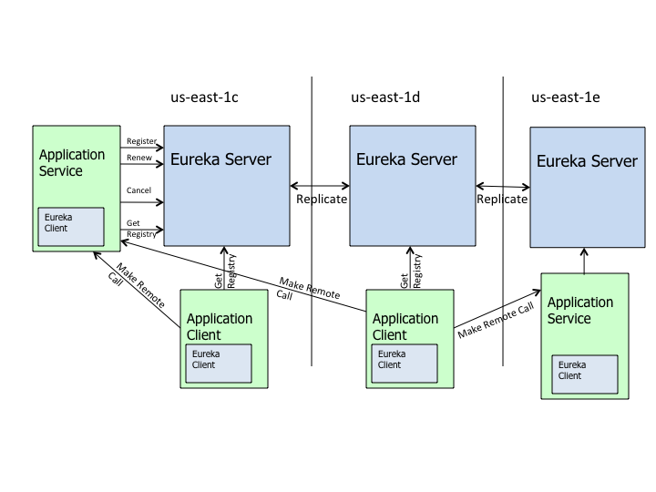
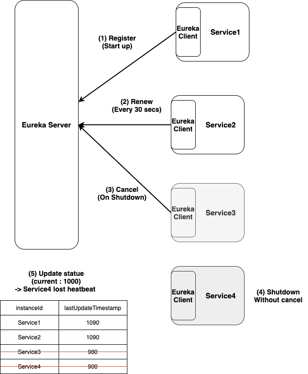
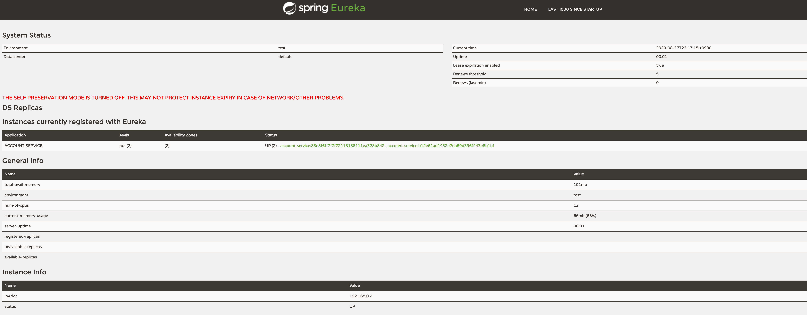

# Service discovery  

# 목차  

- [Overview](#Overview)  
- [DiscoveryClient](#DiscoveryClient)
- [Netflix Eureka](#Netflix-Eureka)
  - [개요](#Netflix-Eureka-개요)
  - [시작하기](#Netflix-Eureka-시작하기)
  - [Eureka HA](#Netflix-Eureka-Server-HA)
- [References](#References)

---  

# Overview  

- 클라우드 네이티브 시스템은 동적이다.(필요에 따라 그때그때 올라가고, 내려가기도 함)  
- 어떤 서비스가 내려가고 올라가더라도 그 서비스를 이용하는 다른 서비스는 영향을 받으면 안된다.
- 해당 서비스를 아래와 같이 설정하면 클라이언트 -> 서버를 고정적으로 결합하므로 동적인 클라우드 네이티브 시스템에는 적합하지 않다.  
```yaml
member-service:
    endpoints:
      - http://172.12.35.65:8080/members
      - http://172.12.35.67:8080/members
```  
- DNS를 이용할 수도 있지만, 클라우드 환경에서는 가장 좋은 방법이라고 볼 수 없다.
  - 클라이언트 내부에 캐시를 둘 수 있다는 것이 장점인데, 사용되지 않는 IP 주소를 캐시하고 있을 수 있다.
  - TTL(time to live) 값을 짧게 잡으면 DNS 레코드를 더 자주 받아오는데 많은 시간을 쓰게 된다.
  - DNS 로드밸런싱을 적용하면 스티키 세션(sticky session)은 지원하지만 그 이상의 기능이 필요하면 감당하기 어렵다.(예를들어 OAuth2나 JWT의
  access token 기반 밸런싱)
  - 프록시 역할을 하는 가상 로드밸런서는 시스템의 상태나 요청 처리에 필요한 작업량을 알지 못한다.
    - 초기 연결을 서비스에 분산할 뿐, 연결에 포함된 요청 처리에 필요한 작업량을 분산하지는 못한다.
- 인프라가 아니라 프로그래밍을 통해 더 나은 라우팅 전략을 구현할 수 있다.(*작업량은 어떻게 분산..?*)

---  

# DiscoveryClient   

- 서비스 레지스트리는 서비스 인스턴스와 서비스가 제공하는 API를 내용으로 하는 테이블이다.  
  - 서비스 레지스트리는 CAP(Consistency 일관성, Availability 가용성, Partition tolerance 분리 내구성) 정리의 제약도 받는다.
- 스프링 클라우드는 DiscoveryClient 추상화를 통해 클라이언트가 다양한 유형의 서비스 레지스트리를 쉽게 이용할 수 있게 해준다.
  - 다양한 구현체들을 Plugin 하여 사용할 수 있다.
  - 클라우드 파운드리, 아파치 주키퍼, 해시코프 컨설, 넷플릭스 유레카, CoreOS etcd
- 일부 서비스 레지스트리는 클라이언트도 레지스트리에 등록해야 한다.  
  - 많은 DiscoveryClient 추상화 구현체는 애플리케이션 기동 시 자동으로 등록해준다.

<br /> 

> DiscoveryClient.java 

```java
package org.springframework.cloud.client.discovery;

import java.util.List;

import org.springframework.cloud.client.ServiceInstance;
import org.springframework.core.Ordered;

public interface DiscoveryClient extends Ordered {

	/**
	 * Default order of the discovery client.
	 */
	int DEFAULT_ORDER = 0;

	/**
	 * A human-readable description of the implementation, used in HealthIndicator.
	 * @return The description.
	 */
	String description();

	/**
	 * Gets all ServiceInstances associated with a particular serviceId.
	 * @param serviceId The serviceId to query.
	 * @return A List of ServiceInstance.
	 */
	List<ServiceInstance> getInstances(String serviceId);

	/**
	 * @return All known service IDs.
	 */
	List<String> getServices();

	/**
	 * Default implementation for getting order of discovery clients.
	 * @return order
	 */
	@Override
	default int getOrder() {
		return DEFAULT_ORDER;
	}
}
```  

<br /> 

간단하게 `org.springframework.cloud.netflix.eureka.EurekaDiscoveryClient` 살펴보면 `com.netflix.discovery.EurekaClient`를 이용하여  
Spring cloud의 `ServiceInstance`로 컨버팅 해주고 있다.  

```java
package org.springframework.cloud.netflix.eureka;

...
public class EurekaDiscoveryClient implements DiscoveryClient {
    ...
	@Override
	public List<ServiceInstance> getInstances(String serviceId) {
		List<InstanceInfo> infos = this.eurekaClient.getInstancesByVipAddress(serviceId,
				false);
		List<ServiceInstance> instances = new ArrayList<>();
		for (InstanceInfo info : infos) {
			instances.add(new EurekaServiceInstance(info));
		}
		return instances;
	}

	@Override
	public List<String> getServices() {
		Applications applications = this.eurekaClient.getApplications();
		if (applications == null) {
			return Collections.emptyList();
		}
		List<Application> registered = applications.getRegisteredApplications();
		List<String> names = new ArrayList<>();
		for (Application app : registered) {
			if (app.getInstances().isEmpty()) {
				continue;
			}
			names.add(app.getName().toLowerCase());

		}
		return names;
	}
    ...
}
```  

<br />

`ServiceInstance`는 Spring Cloud에서 정의한 인터페이스로 host,port 등의 아래와 같은 정보들을 담고있다.  

> org.springframework.cloud.client.ServiceInstance.java

```java
/**
 * Represents an instance of a service in a discovery system.
 */
public interface ServiceInstance {

	/**
	 * @return The unique instance ID as registered.
	 */
	default String getInstanceId() {
		return null;
	}

	/**
	 * @return The service ID as registered.
	 */
	String getServiceId();

	/**
	 * @return The hostname of the registered service instance.
	 */
	String getHost();

	/**
	 * @return The port of the registered service instance.
	 */
	int getPort();

	/**
	 * @return Whether the port of the registered service instance uses HTTPS.
	 */
	boolean isSecure();

	/**
	 * @return The service URI address.
	 */
	URI getUri();

	/**
	 * @return The key / value pair metadata associated with the service instance.
	 */
	Map<String, String> getMetadata();

	/**
	 * @return The scheme of the service instance.
	 */
	default String getScheme() {
		return null;
	}
}
```

---  

# Netflix Eureka  

## Netflix Eureka 개요

> #### Eureka highlevel architecture  

  

- 위와 같이 **Eureka Server**와 Application에 포함된 **Eureka Client**가 존재한다.  
- Application Service를 살펴보면 **Eureka Client**를 통해 **Eureka Server**와 아래와 같은 상호작용을 하고 있다.  

[Eureka wiki-Understanding-eureka-client-server-communication](https://github.com/Netflix/eureka/wiki/Understanding-eureka-client-server-communication)  
  
**Register**  
;Client -> Server에게 최초 Heatbeat에 포함하여 등록 요청을 보낸다.  
  
**Renew**  
30초마다 heatbeat를 보내서 lease를 갱신한다. Server는 마지막 heatbeat를 보낸 시간보다 90초가 지났으면 해당 서비스를 Registry에서 제거한다.  
  
**Fetch Registry**  
Client는 Server로부터 registry 정보를 가져와 로컬 캐시에 담아둔다. 이러한 registry 정보는 service discovery하는데 사용된다.  
(문서를 보면 dirty checking를 통해 효율적으로 정보를 조회한다. 실제 Eureka 코드에도 `InstanceInfo`클래스에 변경 사항이 있을때마다 setDirty()를 호출하고있다.)  

**Cancel**  
Client는 애플리케이션 종료 시 Server에게 Cancel 요청을 보내 registry에서 제거된다.  

  

위와 같은 예를 들어보자.  

- **Service1** : 애플리케이션 시작 시 Eureka 서버에서 Register 요청을 보낸 뒤 서버는 Registry에 추가한다.
- **Service2** : 주기적으로 Heatbeat를 보낸다.(Renew)  
- **Service3** : 애플리케이션 종료 시 Eureka 서버에게 Cancel 요청을 보낸 뒤 서버는 Registry에서 제거한다.  
- **Service4** : 애플리에키션 종료 시 Cancel 요청을 보내지 않은 상태이다.
- **Eureka Server** : Service4에 대하여 마지막 Heatbeat로 부터 90초가 지나서 Registry에서 제거한다.  

더 자세한 Endpoint는 를 살펴보자.

<br />  

## Netflix Eureka 시작하기  

간단하게 Standalone Mode의 Eureka서버를 실행하고, Eureka Client를 포함하고 있는 account service를 실행해보자.  

### Eureka Server 설정  

> application.yaml  

```yaml
eureka:
  # dashboard에 대한 설정으로, http://localhost:3000/eureka-ui 를 통해 확인할 수 있다.
  dashboard:
    path: /eureka-ui
  instance:
    hostname: localhost
    statusPageUrlPath: /info
    healthCheckUrlPath: /health
  # 등록된 인스턴스 중 많은 수가 정해진 시간 내에 Heatbeat를 보내지 않으면 Eureka는 이를 인스턴스 문제가 아닌
  # 네트워크 문제라고 간주하고 Registry를 그대로 유지한다. Example 실행을 위해 false로 설정
  server:
    enableSelfPreservation: false
  client:
    # Eureka client -> Eureka server로 등록 여부
    # standalone mode이므로 자기 자신을 등록할 필요가 없다.
    registerWithEureka: false
    # Eureka Client -> Eureka server로 Registry fetch 여부
    fetchRegistry: false
```  

> @EnableEurekaServer

```java
package server;

import java.util.Arrays;
import java.util.Map.Entry;
import java.util.TreeMap;
import java.util.function.Predicate;

import org.springframework.boot.WebApplicationType;
import org.springframework.boot.autoconfigure.SpringBootApplication;
import org.springframework.boot.builder.SpringApplicationBuilder;
import org.springframework.cloud.netflix.eureka.server.EnableEurekaServer;
import org.springframework.context.ConfigurableApplicationContext;
import org.springframework.web.bind.annotation.GetMapping;
import org.springframework.web.bind.annotation.RestController;

import lombok.extern.slf4j.Slf4j;

@Slf4j
@SpringBootApplication
@EnableEurekaServer
public class EurekaServerApplication {
    public static void main(String[] args) {
        new SpringApplicationBuilder(EurekaServerApplication.class)
                .web(WebApplicationType.SERVLET).run(args);
    }
}
```  

<br />  

### Eureka Client 설정  

> bootstrap.yaml  

```yaml
spring:
  application:
    name: account-service
eureka:
  instance:
    # 랜덤값을 이용하여 instance id를 고유하게 재정의
    instance-id: ${spring.application.name}:${spring.application.instance_id:${random.value}}
```  

> application.yaml  

```yaml
eureka:
  # service instance에 대한 설정
  instance:
    statusPageUrlPath: /actuator/info
    healthCheckUrlPath: /actuator/health
  # eureka client 설정
  client:
    serviceUrl:
      defaultZone: http://localhost:3000/eureka/
# /actuator/info 호출 시 출력 된 Application 정보
info:
  app:
    name: Account Example Application
    version: 1.0.0
    discription: This is a demo project for eurkea
```  

<br />  

미리 정의한 스크립트를 기반으로 Server와 AccountServer(EurekaClient)를 실행해보자.  

> start server/client  

```bash
// eureka 서버 시작하기
$ ./tools/script/start.sh server  

// account 서버1 시작하기(profile:default, port:3100)
$ ./tools/script/start.sh account default 3100

// account 서버2 시작하기(profile:default, port:3101)
$ ./tools/script/start.sh server default 3101
```  

> #### Eureka server dashboard 확인하기
`http://localhost:3000/eureka-ui` 를 접속하면 아래와 같은 화면을 확인할 수 있다.  

  

<br />

> #### DiscoveryClient의 ServiceInstance 리스트 조회하기  

account service에 아래와 같은 코드를 추가해서 `/discovery/services`를 호출하면 모든 인스턴스를 반환하는 API를 추가하자.  

```java
@Autowired
private DiscoveryClient discoveryClient;

@GetMapping("/discovery/services")
public Map<String, List<ServiceInstance>> discoveryServices() {
    return discoveryClient.getServices()
                          .stream()
                          .collect(Collectors.toMap(s -> s, s -> discoveryClient.getInstances(s)));
}
```  

<br />

아래와 같이 요청하면 Spring cloud의 `ServiceInstance` 구현체인 `EurekaServiceInstance`의 응답 결과를 확인할 수 있다.
(instanceId ~ metadata는 ServiceInstance 스펙이고 instanceInfo는 eureka의 InstanceInfo 스펙이다.)  

```
$ curl -XGET http://localhost:3100/discovery/services | jq . 
```  

```json
{
  "account-service": [
    {
      "instanceId": "account-service:b12e61ad1432e7da69d396f443e8b1bf",
      "serviceId": "ACCOUNT-SERVICE",
      "host": "192.168.0.2",
      "port": 3101,
      "secure": false,
      "scheme": "http",
      "uri": "http://192.168.0.2:3101",
      "metadata": {
        "management.port": "3101"
      },
      "instanceInfo": {
        "instanceId": "account-service:b12e61ad1432e7da69d396f443e8b1bf",
        "app": "ACCOUNT-SERVICE",
        "appGroupName": null,
        "ipAddr": "192.168.0.2",
        "sid": "na",
        "homePageUrl": "http://192.168.0.2:3101/",
        "statusPageUrl": "http://192.168.0.2:3101/actuator/info",
        "healthCheckUrl": "http://192.168.0.2:3101/actuator/health",
        "secureHealthCheckUrl": null,
        "vipAddress": "account-service",
        "secureVipAddress": "account-service",
        "countryId": 1,
        "dataCenterInfo": {
          "@class": "com.netflix.appinfo.InstanceInfo$DefaultDataCenterInfo",
          "name": "MyOwn"
        },
        "hostName": "192.168.0.2",
        "status": "UP",
        "overriddenStatus": "UNKNOWN",
        "leaseInfo": {
          "renewalIntervalInSecs": 30,
          "durationInSecs": 90,
          "registrationTimestamp": 1598537803756,
          "lastRenewalTimestamp": 1598537923714,
          "evictionTimestamp": 0,
          "serviceUpTimestamp": 1598537803756
        },
        "isCoordinatingDiscoveryServer": false,
        "metadata": {
          "management.port": "3101"
        },
        "lastUpdatedTimestamp": 1598537803756,
        "lastDirtyTimestamp": 1598537803712,
        "actionType": "ADDED",
        "asgName": null
      }
    },
    {...}
  ]
}
```  

> #### 로그 살펴보기  

- (1) Client는 `GET /eureka//apps/?`를 호출하여 Registry 정보를 가져온다.  

```log
// Client log
2020-08-27 23:36:57.663  INFO 17140 --- [           main] com.netflix.discovery.DiscoveryClient    : Getting all instance registry info from the eureka server
...
2020-08-27 23:36:57.841 DEBUG 17140 --- [           main] n.d.s.t.j.AbstractJerseyEurekaHttpClient : Jersey HTTP GET http://localhost:3000/eureka//apps/?; statusCode=200
2020-08-27 23:36:57.841 DEBUG 17140 --- [           main] c.n.d.s.t.d.RedirectingEurekaHttpClient  : Pinning to endpoint null
2020-08-27 23:36:57.841  INFO 17140 --- [           main] com.netflix.discovery.DiscoveryClient    : The response status is 200
2020-08-27 23:36:57.841 DEBUG 17140 --- [           main] com.netflix.discovery.DiscoveryClient    : Got full registry with apps hashcode 
2020-08-27 23:36:57.842 DEBUG 17140 --- [           main] com.netflix.discovery.DiscoveryClient    : The total number of all instances in the client now is 0


// Server log
2020-08-27 23:36:57.797 DEBUG 17119 --- [nio-3000-exec-1] c.n.e.registry.AbstractInstanceRegistry  : Fetching applications registry with remote regions: false, Regions argument []
2020-08-27 23:36:57.803 DEBUG 17119 --- [nio-3000-exec-1] c.n.eureka.registry.ResponseCacheImpl    : New application cache entry {name=ALL_APPS, type=Application, format=JSON} with apps hashcode
2020-08-27 23:36:57.940 DEBUG 17119 --- [nio-3000-exec-2] c.n.d.util.DeserializerStringCache       : clearing global-level cache with size 1
2020-08-27 23:36:57.940 DEBUG 17119 --- [nio-3000-exec-2] c.n.d.util.DeserializerStringCache       : clearing app-level serialization cache with size 8
```  

- (2) Client는 `POST /eureka//apps/ACCOUNT-SERVICE`를 호출하여 자신의 인스턴스를 **Register** 후 204 Status code로 성공  

```log
// client log
2020-08-27 23:36:57.843  INFO 17140 --- [           main] com.netflix.discovery.DiscoveryClient    : Starting heartbeat executor: renew interval is: 30
...
2020-08-27 23:36:57.852  INFO 17140 --- [           main] o.s.c.n.e.s.EurekaServiceRegistry        : Registering application ACCOUNT-SERVICE with eureka with status UP
...
2020-08-27 23:36:57.855  INFO 17140 --- [nfoReplicator-0] com.netflix.discovery.DiscoveryClient    : DiscoveryClient_ACCOUNT-SERVICE/account-service:a389e2d6e5bf85f9e1544048fbbf8eff: registering service...
...
2020-08-27 23:36:57.954 DEBUG 17140 --- [nfoReplicator-0] n.d.s.t.j.AbstractJerseyEurekaHttpClient : Jersey HTTP POST http://localhost:3000/eureka//apps/ACCOUNT-SERVICE with instance account-service:a389e2d6e5bf85f9e1544048fbbf8eff; statusCode=204
2020-08-27 23:36:57.954 DEBUG 17140 --- [nfoReplicator-0] c.n.d.s.t.d.RedirectingEurekaHttpClient  : Pinning to endpoint null
2020-08-27 23:36:57.954  INFO 17140 --- [nfoReplicator-0] com.netflix.discovery.DiscoveryClient    : DiscoveryClient_ACCOUNT-SERVICE/account-service:a389e2d6e5bf85f9e1544048fbbf8eff - registration status: 204

// server log
2020-08-27 23:36:57.940 DEBUG 17119 --- [nio-3000-exec-2] c.n.e.resources.ApplicationResource      : Registering instance account-service:a389e2d6e5bf85f9e1544048fbbf8eff (replication=null)
2020-08-27 23:36:57.940 DEBUG 17119 --- [nio-3000-exec-2] o.s.c.n.eureka.server.InstanceRegistry   : register ACCOUNT-SERVICE, vip account-service, leaseDuration 90, isReplication false
2020-08-27 23:36:57.941 DEBUG 17119 --- [nio-3000-exec-2] c.n.e.registry.AbstractInstanceRegistry  : No previous lease information found; it is new registration
2020-08-27 23:36:57.941 DEBUG 17119 --- [nio-3000-exec-2] c.n.e.registry.AbstractInstanceRegistry  : Processing override status using rule: [com.netflix.eureka.registry.rule.DownOrStartingRule, com.netflix.eureka.registry.rule.OverrideExistsRule, com.netflix.eureka.registry.rule.LeaseExistsRule, com.netflix.eureka.registry.rule.AlwaysMatchInstanceStatusRule]
2020-08-27 23:36:57.941 DEBUG 17119 --- [nio-3000-exec-2] c.n.e.r.r.AlwaysMatchInstanceStatusRule  : Returning the default instance status UP for instance account-service:a389e2d6e5bf85f9e1544048fbbf8eff
2020-08-27 23:36:57.942 DEBUG 17119 --- [nio-3000-exec-2] c.n.eureka.registry.ResponseCacheImpl    : Invalidating the response cache key : Application ACCOUNT-SERVICE V1 JSON, full
2020-08-27 23:36:57.943 DEBUG 17119 --- [nio-3000-exec-2] c.n.eureka.registry.ResponseCacheImpl    : Invalidating the response cache key : Application ACCOUNT-SERVICE V1 JSON, compact
...
```

- (3) Client는 `PUT /eureka//apps/ACCOUNT-SERVICE/account-service:a389e2d6e5bf85f9e1544048fbbf8eff`를 호출하여 Heartbeat를 보내 **Renew** 작업이 이루어진다.  

```log
// client log
2020-08-27 23:37:27.878 DEBUG 17140 --- [tbeatExecutor-0] n.d.s.t.j.AbstractJerseyEurekaHttpClient : Jersey HTTP PUT http://localhost:3000/eureka//apps/ACCOUNT-SERVICE/account-service:a389e2d6e5bf85f9e1544048fbbf8eff; statusCode=200
2020-08-27 23:37:27.879 DEBUG 17140 --- [tbeatExecutor-0] com.netflix.discovery.DiscoveryClient    : DiscoveryClient_ACCOUNT-SERVICE/account-service:a389e2d6e5bf85f9e1544048fbbf8eff - Heartbeat status: 200
2020-08-27 23:37:27.897 DEBUG 17140 --- [freshExecutor-0] c.n.d.shared.MonitoredConnectionManager  : Released connection is reusable.
...
2020-08-27 23:37:27.897 DEBUG 17140 --- [freshExecutor-0] n.d.s.t.j.AbstractJerseyEurekaHttpClient : Jersey HTTP GET http://localhost:3000/eureka//apps/?; statusCode=200
2020-08-27 23:37:27.897  INFO 17140 --- [freshExecutor-0] com.netflix.discovery.DiscoveryClient    : The response status is 200

// server log
2020-08-27 23:37:27.876 DEBUG 17119 --- [nio-3000-exec-4] o.s.c.n.eureka.server.InstanceRegistry   : renew ACCOUNT-SERVICE serverId account-service:a389e2d6e5bf85f9e1544048fbbf8eff, isReplication {}false
2020-08-27 23:37:27.876 DEBUG 17119 --- [nio-3000-exec-4] c.n.e.registry.AbstractInstanceRegistry  : Fetching applications registry with remote regions: false, Regions argument []
```  

- (4) Client는 `DELETE /eureka//apps/ACCOUNT-SERVICE/account-service:a389e2d6e5bf85f9e1544048fbbf8eff`를 호출하여 Cancel 요청을 보낸 후 서버는 Registry에서 제거한다.  

```log
// client log
2020-08-28 00:02:33.149  INFO 19325 --- [extShutdownHook] o.s.c.n.e.s.EurekaServiceRegistry        : Unregistering application ACCOUNT-SERVICE with eureka with status DOWN
...
2020-08-28 00:02:33.149  INFO 19325 --- [nfoReplicator-0] com.netflix.discovery.DiscoveryClient    : DiscoveryClient_ACCOUNT-SERVICE/account-service:a389e2d6e5bf85f9e1544048fbbf8eff: registering service...
...
2020-08-28 00:02:36.187 DEBUG 19325 --- [extShutdownHook] n.d.s.t.j.AbstractJerseyEurekaHttpClient : Jersey HTTP DELETE http://localhost:3000/eureka//apps/ACCOUNT-SERVICE/account-service:a389e2d6e5bf85f9e1544048fbbf8eff; statusCode=200
2020-08-28 00:02:36.187  INFO 19325 --- [extShutdownHook] com.netflix.discovery.DiscoveryClient    : DiscoveryClient_ACCOUNT-SERVICE/account-service:a389e2d6e5bf85f9e1544048fbbf8eff - deregister  status: 200

// server log
2020-08-28 00:02:36.184 DEBUG 19308 --- [nio-3000-exec-6] o.s.c.n.eureka.server.InstanceRegistry   : cancel ACCOUNT-SERVICE, serverId account-service:a389e2d6e5bf85f9e1544048fbbf8eff, isReplication false
2020-08-28 00:02:36.185 DEBUG 19308 --- [nio-3000-exec-6] c.n.eureka.registry.ResponseCacheImpl    : Invalidating the response cache key : Application ACCOUNT-SERVICE V1 JSON, full
...
2020-08-28 00:02:36.186  INFO 19308 --- [nio-3000-exec-6] c.n.e.registry.AbstractInstanceRegistry  : Cancelled instance ACCOUNT-SERVICE/account-service:a389e2d6e5bf85f9e1544048fbbf8eff (replication=false)
2020-08-28 00:02:36.186 DEBUG 19308 --- [nio-3000-exec-6] c.n.eureka.resources.InstanceResource    : Found (Cancel): ACCOUNT-SERVICE - account-service:a389e2d6e5bf85f9e1544048fbbf8eff
```  

---  

## Netflix Eureka Server HA
  


  

---  

# References  

- https://docs.spring.io/spring-cloud-netflix/docs/2.2.4.RELEASE/reference/html/
- https://medium.com/swlh/spring-cloud-high-availability-for-eureka-b5b7abcefb32  
- https://github.com/Netflix/eureka/wiki/Understanding-Eureka-Peer-to-Peer-Communication
- https://coe.gitbook.io/guide/service-discovery/eureka