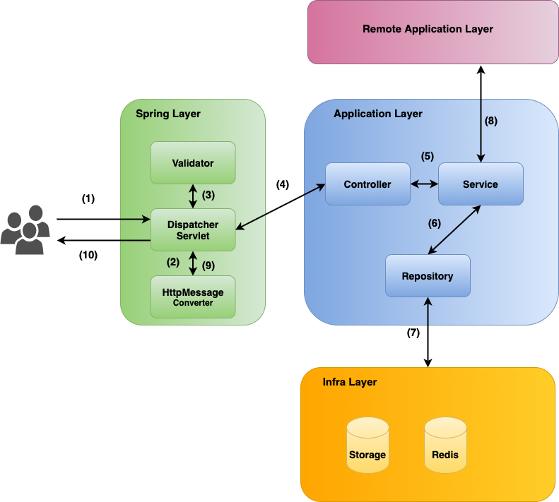
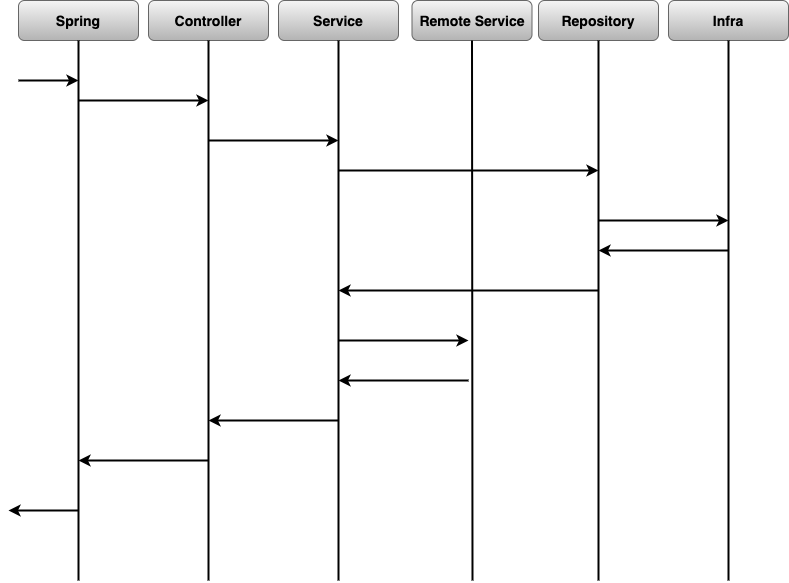

# Spring boot test  

## 목차

- [Overview](#Overview)  
- [Application 구성](#Application-구성)
  - [Repository](#Repository)
  - [Service](#Service)
  - [Controller](#Controller)  
- [Test 작성하기](#Test-작성하기)
  - [Repository 테스트 하기](#Repository-테스트-하기)
  - [Service 테스트 하기](#Service-테스트-하기)
  - [Remote Service Client 테스트 하기](#Remote-Service-Client-테스트-하기)
  - [Controller 테스트 하기](#Controller-테스트-하기)
  - [JSON 테스트 하기](#JSON-테스트-하기)

---  

# Overview

Spring 기반의 RESTFul Web Service는 아래와 같이 표현될 수 있다.  
(HandlerMapping 등은 생략)  

> #### Spring layer

  

(출처: https://terasolunaorg.github.io/guideline/5.0.1.RELEASE/en/ArchitectureInDetail/REST.html)  

- (1) : User -> WebService로 HTTP POST 요청(Create)
- (2) : JSON 포맷의 Request Body를 읽어서 Resource Object로 변환
- (3) : Resource Object의 Validation 체크
- (4) : 해당 Controller의 메소드 call
- (5) : Controller -> Service call
- (6) : Service -> Repository call
- (7) : Repository -> Database Create
- (8) : Service -> Remote Service call
- (9) : Controller에서 반환된 Object를 JSON 포맷으로 response body에 포함
- (10) : Server -> User HTTP Response  

<br />  

즉 개발자가 작성하는 부분은 Application Layer의 파란색 부분이고 각 구간에 대하여 어떻게 테스트할 수 있는지 살펴보자.  

시퀀스 다이어그램으로 그리면 아래와 같이 다시 표현할 수 있다.  

  

우선 테스트를 위한 Application을 만들어보고 Spring에서 제공하는 `@WebMvcTest`, `@DataJpaTest`, `@RestClientTest`등의  
어노테이션을 통해 필요한 구간만 테스트할 수 있는 테스트 슬라이스에 대하여 살펴보자.  

---  

# Application 구성  

**Note** : 테스트를 위한 Application이므로 예외처리 등 모두 생략

간단하게 아래와 같은 Article에 대한 CRUD API를 제공하는 애플리케이션을 작성하자.  

- Article 생성 시 Account Service(Remote Service)에게 `GET /v1/account/me`를 호출하여 Profile 정보를 조회한다.
- 모든 Article 조회 시 Account Service(Remote Service)에게 `GET /v1/account/{accountId`를 호출하여 Author 정보를 추가한다.

> #### Article API

| **Endpoint**                                 | **Description**   |
|----------------------------------------------|-------------------|
| GET /v1/articles?page=1&size=10&sort=id,DESC | article page 조회 |
| POST /v1/article                             | article 생성      |
| GET /v1/article/{slug}                       | article 조회      |
| DELETE /v1/article/{slug}                    | article 삭제      |

> #### Account API

| **Endpoint**                        | **Description**           |
|-------------------------------------|---------------------------|
| GET /v1/account/me                  | 현재 사용자 Profile 조회  |
| GET /v1/account/profile/{accountId} | 해당 Account Profile 조회 |

## Repository  

> ### ArticleEntity  

```java
@Entity(name = "Article")
@Getter
@Setter(AccessLevel.PROTECTED)
@NoArgsConstructor(access = AccessLevel.PROTECTED)
public class ArticleEntity extends BaseEntity {

    @Id
    @GeneratedValue(strategy = GenerationType.IDENTITY)
    @Column(name = "article_id")
    private Long id;

    @Column(name = "slug", unique = true)
    private String slug;

    @Column(name = "title")
    private String title;

    @Column(name = "description")
    private String description;

    @Column(name = "author_id")
    private String authorId;

    /**
     * Create a new {@link ArticleEntity} given args
     */
    public static ArticleEntity createArticle(String title, String description, String authorId) {
        final ArticleEntity entity = new ArticleEntity();

        entity.setSlug(toSlug(title));
        entity.setTitle(title);
        entity.setDescription(description);
        entity.setAuthorId(authorId);

        return entity;
    }

    private static String toSlug(String title) {
        return title.toLowerCase().replaceAll("[\\&|\\uFE30-\\uFFA0|\\’|\\”|\\s\\?\\,\\.]+", "-");
    }
}
```  

> ### ArticleRepository  

```java
public interface ArticleRepository extends JpaRepository<ArticleEntity, Long> {

    /**
     * Returns a optional of {@link ArticleEntity} given slug value
     */
    Optional<ArticleEntity> findBySlug(String slug);

    /**
     * Delete a article with given slug
     */
    @Modifying
    @Query("DELETE FROM Article a WHERE a.slug=:slug")
    Integer deleteBySlug(@Param("slug") String slug);
}
```

## Service  

> ### ArticleResource (DTO)  

```java
@Data
@NoArgsConstructor
@AllArgsConstructor
@Builder
public class ArticleResource {

    private String slug;

    @NotEmpty
    private String title;

    @NotEmpty
    private String description;

    private AuthorResource author;

    private LocalDateTime createdAt;

    private LocalDateTime updatedAt;

    @JsonProperty
    public String getSlug() {
        return slug;
    }

    @JsonIgnore
    public void setSlug(String slug) {
        this.slug = slug;
    }

    @JsonIgnore
    public void setCreatedAt(LocalDateTime createdAt) {
        this.createdAt = createdAt;
    }

    @JsonIgnore
    public void setUpdatedAt(LocalDateTime updatedAt) {
        this.updatedAt = updatedAt;
    }
}
```  

> ### ArticleAssembler (Entity -> DTO 변환)

```java
public final class ArticleAssembler {

    /**
     * Convert {@link ArticleEntity} and {@link AccountProfile} to {@link ArticleResource}
     */
    public static ArticleResource toResource(ArticleEntity entity, AccountProfile profile) {
        return ArticleResource.builder()
                              .slug(entity.getSlug())
                              .title(entity.getTitle())
                              .author(AuthorResource.builder()
                                                    .authorId(entity.getAuthorId())
                                                    .name(profile.getName())
                                                    .bio(profile.getBio())
                                                    .build())
                              .description(entity.getDescription())
                              .createdAt(entity.getCreatedAt())
                              .updatedAt(entity.getUpdatedAt())
                              .build();
    }

    /**
     * Convert {@link ArticleResource} and {@link AccountProfile} to {@link ArticleEntity}
     */
    public static ArticleEntity toEntity(ArticleResource resource, AccountProfile profile) {
        return ArticleEntity.createArticle(resource.getTitle(), resource.getDescription(), profile.getAccountId());
    }

    private ArticleAssembler() {
    }
}
```

> ### ArticleService  

```java
@Slf4j
@Service
@RequiredArgsConstructor
@Transactional(readOnly = true)
public class ArticleService {

    private final ArticleRepository articleRepository;
    private final AccountRemoteService accountService;
    private final CacheManager cacheManager;

    public Page<ArticleResource> getArticles(Pageable pageable) {
        Page<ArticleEntity> page = articleRepository.findAll(pageable);

        if (!page.hasContent()) {
            return Page.empty();
        }

        final List<ArticleResource> resources = page.getContent().stream().map(entity -> {
            final AccountProfile profile = getAccountProfileById(
                    entity.getAuthorId());
            return ArticleAssembler.toResource(entity, profile);
        }).collect(Collectors.toList());

        return new PageImpl<>(resources, page.nextPageable(), page.getTotalElements());
    }

    @Transactional
    public ArticleResource saveArticle(ArticleResource articleResource) {
        final AccountProfile profile = accountService.getAuthenticatedAccount();
        final ArticleEntity saved = articleRepository.save(ArticleAssembler.toEntity(articleResource, profile));
        final ArticleResource resource = ArticleAssembler.toResource(saved, profile);

        try {
            final Cache cache = cacheManager.getCache("article");

            if (cache != null) {
                cache.put(resource.getSlug(), resource);
            }
        } catch (Exception ignored) {
            logger.warn("failed to put article. reason: {}", ignored.toString());
        }
        return resource;
    }

    @Cacheable(value = "article", key = "#slug")
    public Optional<ArticleResource> getArticleBySlug(String slug) {
        Optional<ArticleEntity> entityOptional = articleRepository.findBySlug(slug);
        if (!entityOptional.isPresent()) {
            return Optional.empty();
        }

        final ArticleEntity entity = entityOptional.get();
        final AccountProfile profile = getAccountProfileById(entity.getAuthorId());

        return Optional.of(ArticleAssembler.toResource(entity, profile));
    }

    @CacheEvict(value = "article", key = "#slug")
    @Transactional
    public Integer deleteArticleBySlug(String slug) {
        return articleRepository.deleteBySlug(slug);
    }

    private AccountProfile getAccountProfileById(String accountId) {
        return accountService.getAccountProfileById(accountId);
    }
}
```  

> ### AccountProfile  

```java
@Data
@NoArgsConstructor
@AllArgsConstructor
@Builder
public class AccountProfile {

    private String accountId;
    private String name;
    private String bio;
}
```

> ### AccountRemoteService  

```java
@Slf4j
@Service
public class AccountRemoteService {

    private final String endpoint;
    private final RestTemplate restTemplate;

    @Autowired
    public AccountRemoteService(RestTemplate restTemplate,
                                @Value("${account-service.host:account-service}") String endpoint) {

        logger.info("## initialize account service. host: {} / restTemplate : {}", endpoint,
                    restTemplate.getClass().getName());

        this.endpoint = endpoint;
        this.restTemplate = restTemplate;
    }

    /**
     * Call {endpoint}/v1/account/me to get current authenticated account
     */
    public AccountProfile getAuthenticatedAccount() {
        final URI uri = UriComponentsBuilder.fromHttpUrl(endpoint)
                                            .pathSegment("v1", "account", "me")
                                            .build()
                                            .toUri();
        return restTemplate.getForObject(uri, AccountProfile.class);
    }

    /**
     * Call {endpoint}/v1/account/profile/{accountId} to get given account's profile
     */
    public AccountProfile getAccountProfileById(String accountId) {
        final URI uri = UriComponentsBuilder.fromHttpUrl(endpoint)
                                            .pathSegment("v1", "account", "profile", accountId)
                                            .build()
                                            .toUri();
        return restTemplate.getForObject(uri, AccountProfile.class);
    }
}

```

## Controller  

```java
@Slf4j
@RestController
@RequiredArgsConstructor
public class ArticleController {

    private final ArticleService articleService;

    /**
     * Get articles given page request
     */
    @GetMapping("/v1/articles")
    public PagedResource<ArticleResource> getArticles(
            @PageableDefault(sort = { "id" }, direction = Sort.Direction.DESC, size = 5) Pageable pageable) {
        logger.info("## Request articles. pageable : {}", pageable);
        StringBuilder sb = new StringBuilder();
        for (StackTraceElement elt : Thread.currentThread().getStackTrace()) {
            sb.append(elt.toString()).append('\n');
        }
        logger.info("Stack trace:\n{}", sb.toString());

        final Page<ArticleResource> page = articleService.getArticles(pageable);
        return PagedResource.toPagedResource(URI.create("/v1/articles"), page);
    }

    /**
     * Save a new article
     */
    @PostMapping("/v1/article")
    public ResponseEntity saveArticle(@Valid @RequestBody ArticleResource article, Errors errors) {
        if (errors.hasErrors()) {
            return ResponseEntity.badRequest().body(errors);
        }

        return ResponseEntity.ok(articleService.saveArticle(article));
    }

    /**
     * Get a article by slug
     */
    @GetMapping("/v1/article/{slug}")
    public ResponseEntity getArticle(@PathVariable("slug") String slug) {
        Optional<ArticleResource> articleOptional = articleService.getArticleBySlug(slug);
        if (!articleOptional.isPresent()) {
            return ResponseEntity.notFound().build();
        }
        return ResponseEntity.ok(articleOptional.get());
    }

    @DeleteMapping("/v1/article/{slug}")
    public ResponseEntity deleteArticle(@PathVariable("slug") String slug) {
        final Integer deleted = articleService.deleteArticleBySlug(slug);
        if (deleted == 0) {
            return ResponseEntity.notFound().build();
        }
        return ResponseEntity.ok().build();
    }
}
```

---  

# Test 작성하기  

## Repository 테스트 하기
; TBD

## Service 테스트 하기
; TBD

## Remote Service Client 테스트 하기
; TBD

## Controller 테스트 하기
; TBD

## JSON 테스트 하기
; TBD


